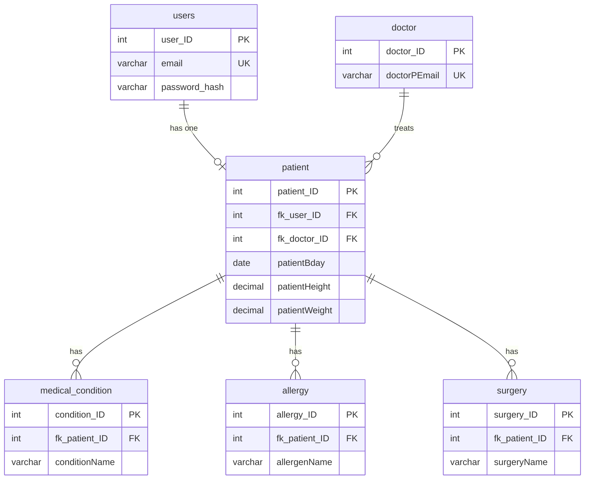

# MEDIVAULT

<!-- After pushing, add your CI badge:  -->

A medical history web app. Users sign up, fill out a medical history form, and view their record on a dashboard. Built to show Bootstrap 5 on the front end and MySQL on the back end.

> All sample data is fake. Do not store real medical information in a demo.

<!--
## Screenshots

| Home | Form |
| --- | --- |
|  |  |

| Dashboard | Settings |
| --- | --- |
|  |  |
-->

## Features

* Sign up and log in with hashed passwords (bcrypt) and sessions stored in MySQL
* Medical history form with add and delete rows for conditions, allergies, and surgeries
* Preview modal before saving, with checks on both the browser and the server
* Dashboard that reads the record from the database
* Settings page to edit personal info, change email, phone, or password, and delete the account
* Saving a record runs in one SQL transaction, so a failed save never leaves half a record

## Tech stack

| Part | Tools |
| --- | --- |
| Front end | HTML, CSS, Bootstrap 5.3 (grid, navbar, modals, alerts, spinner), vanilla JavaScript, Font Awesome |
| Back end | Node.js, Express, express-session with a MySQL session store, bcryptjs |
| Database | MySQL 8 (MariaDB 10.5+ also works), mysql2 with prepared statements |
| Tooling | Docker, GitHub Actions CI, Node's built in test runner |

## Run it locally

You need Node.js 18 or newer and a running MySQL server.

1. Install packages: `npm install`
2. Copy `.env.example` to `.env` and fill in your MySQL password and a long random `SESSION_SECRET`
3. Create the database with sample data: `npm run db:seed` (this resets the tables)
   Use `npm run db:init` instead for empty tables.
4. Start the app: `npm start`, then open http://localhost:3000

Demo login: `demo@medivault.test` with password `Demo@1234`

## Run with Docker

```bash
docker compose up --build
```

Open http://localhost:3000. The first start builds the database and loads sample data. See [docs/DEPLOYMENT.md](docs/DEPLOYMENT.md) for hosting steps and [docs/ARCHITECTURE.md](docs/ARCHITECTURE.md) for how it works.

## Project structure

```
server.js              Express app, sessions, page protection, /health
config/                database pool, MySQL session store
routes/                auth (sign up, log in, out) and patient (record, settings)
middleware/auth.js     login checks and a small rate limiter
db/                    schema.sql, seed.sql, queries.sql
scripts/init-db.js     builds the database (db:init, db:seed, db:ensure)
test/api.test.js       16 tests: auth, validation, transactions, cascade, sessions, queries
public/                pages, CSS, images, and browser scripts
docs/                  architecture, deployment, screenshots
Dockerfile             container image
docker-compose.yml     app plus MySQL in one command
.github/               CI workflow and dependency updates
```

## Database



SQL concepts used:

* Primary keys, foreign keys, unique keys, `ON DELETE CASCADE` and `ON DELETE SET NULL`
* `CHECK` constraints on height and weight, `ENUM` columns for fixed choices
* A view (`v_patient`) that calculates age and joins the login email, so age never goes stale
* Indexes on foreign keys and on searched columns
* Transactions for saving a record and for changing account details
* Prepared statements everywhere, which blocks SQL injection
* `JOIN`, `GROUP BY`, `HAVING`, `EXISTS`, `LEFT JOIN ... IS NULL`, and `UNION ALL` in `db/queries.sql`

Run the practice queries with: `mysql -u root -p medivault < db/queries.sql`

## Security notes

* Passwords are hashed with bcrypt, and login errors do not reveal whether an email exists
* Failed logins and signups are rate limited (in memory, resets when the server restarts)
* Stored text is shown with `textContent`, so it can never run as HTML
* Cookies are `httpOnly` and `sameSite=lax`, and `secure` in production
* Sessions are stored in MySQL, so they survive restarts and expire on their own
* In production the app refuses to start without a `SESSION_SECRET`
* Every query uses placeholders, so SQL injection is blocked

## Tests

`npm test` builds a separate `medivault_test` database and checks sign up and login rules, password hashing, saving and editing a record, server side validation, rollback on a failed save, settings, account deletion with cascade, the MySQL session store, the rate limiter, and that every query in `db/queries.sql` returns rows. The GitHub Actions workflow runs the same tests on Node 20 and 22 for every push and checks that the Docker image builds.

## Known limits

* Medical details are sensitive. Use fake data in a demo, and add consent, encryption at rest, audit logs, and access controls before using real patient data
* The service and background images are from the original project. Check you have the right to use them before publishing
* No password reset or email verification yet
* The rate limiter is in memory, so it is per instance

## Roadmap

* Password reset and email verification
* Keep a history of changes to a record
* Doctor accounts that can view the records of their own patients
* Export a record as a PDF

## Team

Add the names of your group members and each person's part here.
