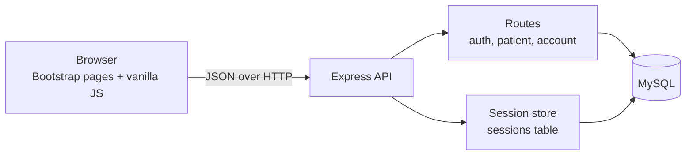
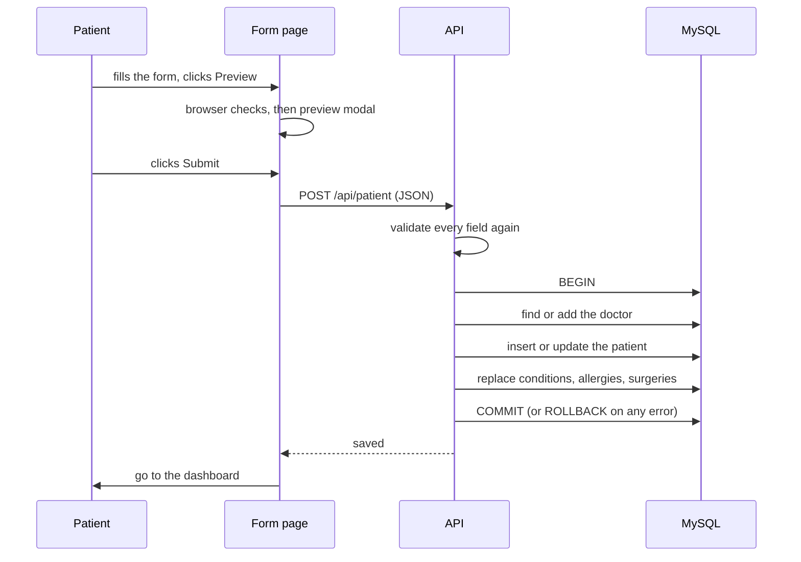

# Architecture

## Overview

The browser never talks to the database. Pages call the API with `fetch`, and the server checks the login, validates the data, and runs prepared SQL.

## Saving a medical record

## Design decisions

| Decision | Reason |
| --- | --- |
| Age is calculated in a view (`v_patient`) | A stored age goes stale. The view always uses today's date. |
| Child lists are replaced on every save | It is the simplest way to handle edits and deletions from the form, and it runs inside the same transaction. |
| `ON DELETE CASCADE` on patient lists | Deleting an account removes the patient and everything under it with one statement. |
| Sessions are stored in MySQL | Logins survive restarts and the app can run on a host that restarts it. The default memory store cannot. |
| Passwords use bcrypt | Only salted hashes are stored. |
| The server validates everything again | Browser checks are for convenience. The server is the one that must be trusted. |
| Dates are plain text (`YYYY-MM-DD`) | Avoids time zone shifts between the browser, server, and database. |

## Limits to know about

* The login rate limiter is in memory, so it resets on restart and is per instance.
* No password reset, email verification, or two factor login yet.
* The form replaces lists on save, so there is no history of past versions.
